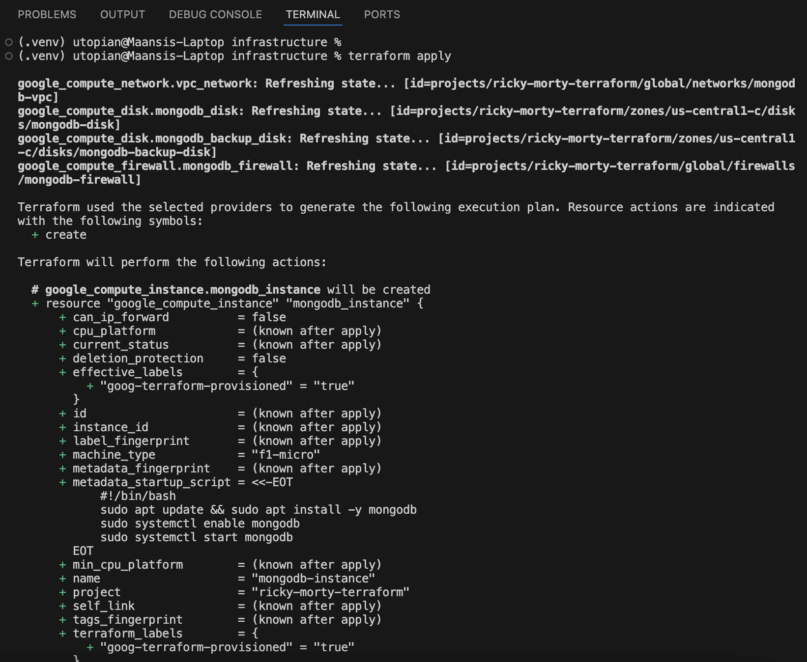
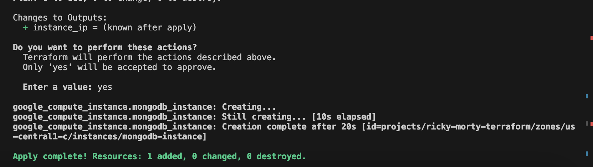
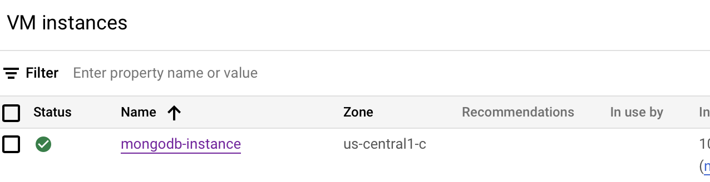
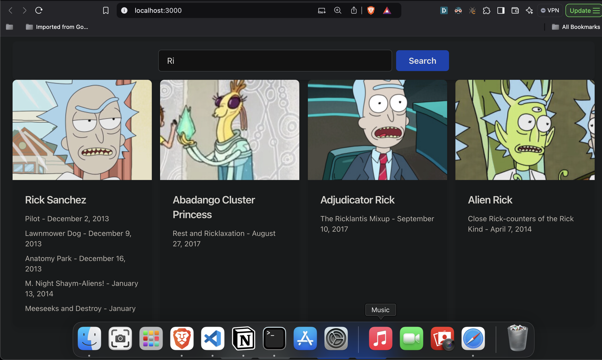

# **Ricky Morty Terraform Project**

This project integrates Terraform, Go, and a frontend UI to automate infrastructure provisioning, data insertion, data fetching, and user-friendly interaction with the system.

---

## **Project Structure**
- **Terraform**: For infrastructure provisioning using Google cloud provider.
- **Backend (Go)**: For fetching data from the backend.
- **Frontend (React using typescript and tailwindCss)**: A user interface to display the data.

---

## **Setup Instructions**

### **1. Prerequisites**
Ensure you have the following installed:
- **Terraform**
- **Google Cloud CLI and google cloud account**
- **Python 3.11**
- **Go**
- **React.js** (for the frontend)

---

### **2. Setting up Google Cloud Platform (GCP) Account**

Before using Terraform to deploy infrastructure on Google Cloud, you'll need to set up your **GCP account** and get the necessary credentials.

#### **a. Create a GCP Account**
1. Go to [Google Cloud](https://cloud.google.com/) and create an account if you don't have one already.
2. Set up your **Billing Account** within Google Cloud if you haven't already.

#### **b. Enable Google Cloud APIs**
1. Navigate to the **API Library** in the Google Cloud Console.
2. Enable the following APIs for your project:
   - **Compute Engine API**
   - **Enable Block storage for compute engine**

#### **c. Create a Service Account for Terraform**
1. Go to **IAM & Admin> Service Accounts. Click on Create Service Account name for the service account**.
4. Assign the **roles** necessary for Terraform to manage resources. Common roles include:
   - **Project Owner**
   - **Compute Admin**
   - **Storage Admin**
5. Once the service account is created, generate a **JSON key** and download it to your local machine.

#### **d. Authenticate Terraform with GCP**
1. Set the `GOOGLE_APPLICATION_CREDENTIALS` environment variable to the path of your service account key file:
   ```bash
   export GOOGLE_APPLICATION_CREDENTIALS="/path/to/your/service-account-file.json"

### **3. Infrastructure Setup with Terraform**
1. Navigate to the `terraform/` directory:
   ```bash
   cd terraform/
2. Initialize Terraform to install the required provider plugins::
   ```bash
   terraform init
3. Plan the infrastructure (This will display the changes Terraform will make):
   ```bash
   terraform plan
   

4. Apply the infrastructure (This will provision the infrastructure based on your configuration):
   ```bash
  terraform apply
   ```


MongoDb instance Up and running


### 4. Data Insertion Using Python

### Step 1: Navigate to the Python Script Directory
Use the following command to navigate to the directory containing the Python script:

```bash
cd python-script/
python3 script.py // your script file name
```

### 5. Backend(GO) Application Setup

Step 1: Navigate to the Go Application Directory
Use the following command to move to the Go application directory, build and run application

```bash
cd go-app/
go build -o app main.go
./app
```

### 5. Frontend(React + Angular + Tailwind + Pagination) Setup

Step 1: Navigate to the Frontend Directory and create initialise react project using typescript and setup tailwind.
Move to the directory containing the frontend code and update src folder using provided src code:

```bash
cd frontend/
npm install
npm start
```



